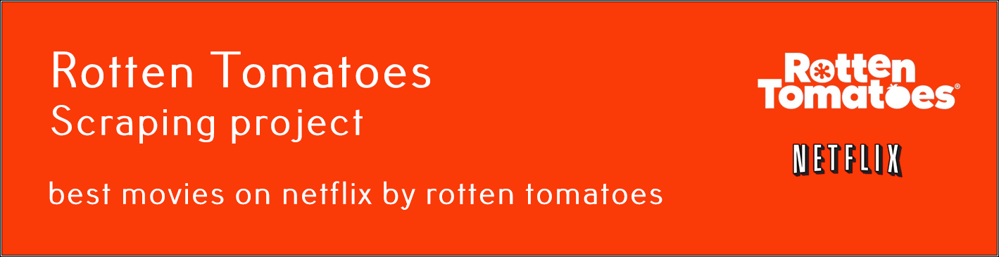
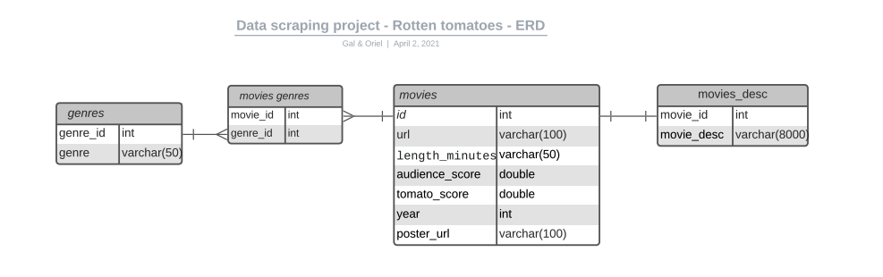

Chaos + Prints designed by Craig Henry

# rotten_tomatoes_scraping
This program scrapes the current top 100 movies on Netflix by RottenTomatoes website, adds IMDb score to them (With OMDb API), and returns a list of movies. The user can enter input filters (year of release, 
prefered genres, score etc.), and the program will return the most relevant list to the user.

### Installation

Install the dependencies from the requirements text file, and run the main.py file
Using Python 3.9
```sh
$ git clone https://github.com/GalSalomon/rotten_tomatoes_scraping
$ cd rotten_tomatoes_scraping/
$ sudo pip3 install -r requirements.txt
```

### How to use
* Start you MySQL server 
* Run the program on your terminal to get the top 10 movies:
```sh
$ python main.py 
```
* You can enter -h arg to see the help tooltip
```sh
$ python main.py -h
```
output:
```sh
usage: main.py [-h] [-s] [-l] [-min_y] [-max_y] [-g [...]]

Get the current top Netflx movies accorting to Rotten Tomatoes and IMDb.

optional arguments:
  -h, --help            show this help message and exit
  -s , --score          The score used. Could be Tomato or IMDb. Default is Both
  -l , --limit          Limit of results. Default 10
  -min_y , --min_year   Minimum year. Default None
  -max_y , --max_year   Miximum year. Default None
  -g [ ...], --geners [ ...]
                        List of Geners to filter. Default None

```
#### Available filters and options:

##### -s
* The Score used to rank the results. The available scores are IMDb, tomato and both.
The default is both.
1. IMDb score means that the program uses only the scores provided by the IMDb 
website.
2. tomato score means that the program uses only the scores provided by the rotten tomatoes 
website critics (professional critics reviews)
3.  both means the program uses the average of both. This is the default

##### -l
* The number of results returned. Defaut in 10. The user can enter any number between 5 and 100
inclusive. Bear in mind that if the user enters some filters, the number of movies returned 
in the results could be lower than the limit entered.

##### -min_year
* The minimum year of release. For example, if the user enteres 1990, the results will include 
only movies which were released after this year

##### -max_year
* The maximum year of release. For example, if the user enteres 2000, the results will include 
only movies which were released before this year

##### -g
* List of genres the user would like. the program will filter only movies from this list.

Example of a valid input:
```sh
python main.py -l 6 -min_y 1967 -max_y 2012 -g Horror Drama
```

### Scraping process:
* Requesting responses from the website using grequest.
* Creating soup objects from responses using BS4, each soup represents a movie's page.
* Scraping useful data from the soup objects, by filtering HTML tags and classes.
* Arranging data in a pandas dataframe.
* Exporting the dataframe to an out.csv file


### Conf and env files:
* Conf.py will contain OMDB_API_URL, BATCH_SIZE for grequest scraping function, and the URL of the 100 best movies on Rotten Tomatoes.
* .env file will contain the local database login credentials.


### SQL Scheme Diagram

### The SQL Tables Explanation

#### movies Table:
* id - int - primary key
* url - varchar(100) - the rotten tomatoes movie url with all the data about the movie
* length_minutes - varchar(50) - the length of the movie with format HH:MM
* audience_score - double - current average audience score at rotten tomatoes website
* tomato_score - double - current average critics review score at rotten tomatoes website
* year - int - the year the movie was releaseed
* poster_url - varchar(100) - the link to the poster utl at rotten tomatoes
#### genres Table:
* genre_id - int - primary key
* genre - varchar(50) - the genre of the movie
#### movie_genre Table:
* movie_id - int - foreign key from movies table
* genre_id - int - foreign key from genres table 
#### movies_desc Table:
* movie_id - int - foreign key from movies table
* movie_dec - varchar(8000) - the description of the movie at rotten tomatoes website


### Credit
Made by Gal Salomon and Oriel Pinhas during the "Israel Tech Challenge" program

